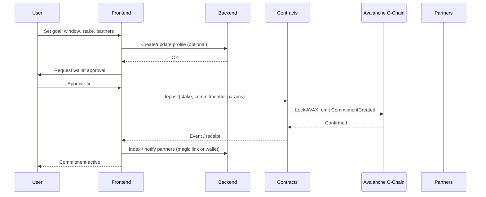
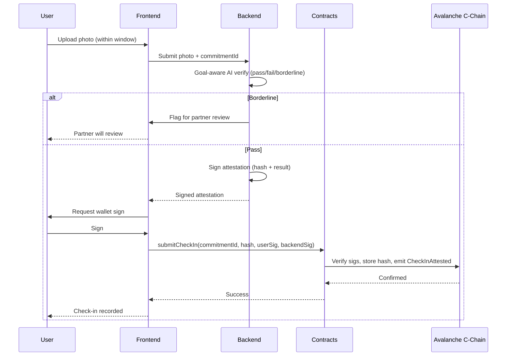
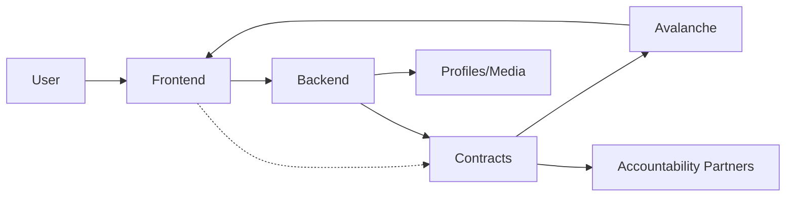

## Abstract

LockIn Protocol turns habit-building from optional intention into structured, verifiable action. Users set daily commitments with optional photo check-ins; they may stake AVAX in escrow smart contracts on Avalanche. Stakes are locked until commitment outcomes are resolved: success returns tokens (with optional rewards), failure automatically releases stakes to accountability partners or a Lock In Reserve. Peer challenges and support are integrated; all commitment and stake outcomes are recorded on-chain for transparency and tamper-proof verification. The system targets students and young professionals who want enforceable accountability beyond reminders and bypassable blockers.

## Specification

### 1. Scope and Actors

- **Users**: Students and young professionals (B2C) who create commitments, optionally stake AVAX, and participate in peer challenges or support.
- **Accountability partners**: Peers who receive a share of failed stakes or provide support; may be designated per commitment or per challenge.
- **Lock In Reserve**: Protocol-controlled pool that may receive a portion of failed stakes (e.g., slashing); used for rewards, operations, or governance as defined by protocol parameters.

### 2. Core Entities

- **Commitment**: A user-defined goal (e.g., “no social media,” “study 4 hours”) with a time window (e.g., daily), optional photo check-in requirements, and optional stake amount in AVAX.
- **Stake**: AVAX locked in a smart contract escrow for a commitment; released only on success (back to user ± rewards) or failure (to partners and/or Lock In Reserve).
- **Challenge**: A peer-to-peer structure where two or more users commit to the same or related goals; stakes and outcomes may be linked (e.g., winner takes slashed stakes or shared rewards).
- **Check-in**: Evidence of compliance (e.g., daily photo); may be required to mark a commitment as successful. Check-in rules (frequency, type) are defined per commitment type.

### 3. On-Chain Behavior and Triggers

All stake-related flows are on Avalanche C-Chain (or specified EVM-compatible chain).

- **Stake lock**: When a user creates or joins a commitment with a stake, they approve and deposit AVAX into the protocol escrow contract; the contract records commitment id, user, amount, and resolution rules.
- **Success path**: When a commitment is successfully completed (e.g., all required check-ins submitted and validated within the window), the contract releases the user’s stake back to the user; optional reward logic may add tokens from the Lock In Reserve or challenge pool.
- **Failure path**: If the user fails (e.g., missed check-in, explicit failure, or timeout), the contract automatically releases the staked AVAX according to configured rules: to designated accountability partners and/or to the Lock In Reserve. No central party can unilaterally move funds; logic is fully on-chain.
- **Challenge resolution**: For peer challenges, resolution rules (e.g., both succeed / one fails / both fail) are encoded in the contract; payouts to partners or reserve follow these rules.
- **Persistence**: Commitment creation, stake lock/unlock, and resolution events are emitted and stored on-chain so that history is transparent and auditable.

### 4. Off-Chain and Client Components

- **Photo check-ins**: Submitted via app (web or mobile); verification can be hybrid (e.g., hash or attestation stored on-chain, heavy verification off-chain with on-chain result).
- **Commitment and challenge setup**: Users configure commitments, stakes, and partners in the client; the client triggers the appropriate contract calls (deposit, set parameters).
- **Notifications and reminders**: Handled off-chain to improve UX; do not by themselves trigger on-chain transactions.
- **Off-chain data governance**: Retention for photos and metadata (e.g., in Supabase) is defined at the app/backend layer; users have rights to access and delete their off-chain data (see Compliance and Regulatory Context). Stored photos for audit are subject to a defined retention period and access control (backend/admin only, for dispute resolution and security reviews).

### 5. Technical Stack (Reference)

- **Chain**: Avalanche C-Chain (EVM).
- **Contracts**: Solidity 0.8.25+; EscrowLock, CommitmentResolver (Foundry).
- **Frontend**: Next.js 15, wagmi/viem, Tailwind; Vercel.
- **Backend**: Node.js/Express; Moralis, Supabase, Firebase; photo verification (e.g., AWS Rekognition or CLIP).

### 6. Compliance and Verification

- Commitment and stake parameters (amounts, deadlines, resolution rules) are defined at creation and enforced by the smart contract.
- Success/failure is determined by contract logic (e.g., check-in attestations or time-based rules); disputed outcomes may be handled by predefined escalation (e.g., arbitrator address) if specified in the contract design.
- **Test strategy and security audit**: Contract testing includes unit and integration tests (Foundry); full flows are validated E2E on Fuji testnet. A professional security audit of EscrowLock and CommitmentResolver is required before mainnet deployment.

### 7. Technical Documentation

**Tech stack**

- **Chain and contracts**: Avalanche C-Chain (EVM); Solidity 0.8.25+; Foundry for dev/test/deploy. Contracts: **EscrowLock** (stake deposit/release), **CommitmentResolver** (check-in validation, timeout/failure logic, partner payouts).
- **Frontend**: Next.js 15 (React), wagmi/viem for Web3, Tailwind CSS; hosted on Vercel. Web-only for MVP; mobile (React Native) as Could Have post-MVP.
- **Backend**: Node.js/Express; Moralis API for Fuji/Mainnet indexing; Supabase for off-chain user profiles and check-in metadata; Firebase for push/email notifications. Photo verification via AWS Rekognition or open-source ML (e.g., CLIP for semantic match). Hosting: AWS Lambda or Vercel. A dedicated backend is required for reliable photo validation and UX (indexing, reminders).
- **Check-in data**: Full photos and metadata in Supabase or IPFS (pinned via backend); only hash and signed attestation (user + backend signature) stored on-chain. Retention for photos/metadata is defined at app layer; audit-use retention and access (backend/admin, for disputes and security reviews) should be time-limited and access-controlled.

**Architecture decisions**

- **Non-custodial escrow**: Contract-only fund control; users approve exact amounts at creation. No admin overrides or custodial elements.
- **Hybrid verification**: Backend validates photos (anti-fraud, goal-aware AI) but submits oracle-like signed hash to chain; trust-minimized via signature verification on-chain.
- **Avalanche C-Chain**: Sub-second finality, low fees (e.g., &lt;$0.01 per stake/resolve tx) for daily commitments.
- **Optional staking**: Full habit tracking without crypto barrier; staking is opt-in for stronger enforcement.

**Implementation approach**

1. Foundry contracts + unit/integration tests, deploy to Fuji testnet. 2. Next.js frontend (wallet connect, commitment UI, history via indexer). 3. Backend (verification endpoints, notifications, indexing). 4. E2E tests, security audit of contracts, then Mainnet deploy.

**Implementation tradeoffs**

| Decision | Option A (chosen) | Option B (rejected) | Tradeoff |
|----------|-------------------|---------------------|----------|
| Verification | Backend AI + signed attestation on-chain | Full on-chain verification | Trust backend for speed/cost; minimize trust via signatures and dispute layer. |
| Escrow | Non-custodial contract-only | Custodial or admin override | No fund control by operator; users bear key loss risk. |
| Chain | Avalanche C-Chain | ETH L1 / other L2s | Sub-second finality and low fees vs ecosystem size; chosen for daily-commitment UX. |
| Photo storage | Supabase (+ hash on-chain) | Full on-chain / IPFS-only | Cost and privacy; MVP uses centralized storage with defined retention and access control. |
| Partner invite | Magic link + wallet bind | Wallet-only | Friction vs growth; magic link lowers barrier, wallet required for payout. |
| Reserve | 100% to partners in MVP | Reserve split from day one | Simpler contract and messaging; reserve deferred to Could Have. |

**Out of scope (explicit boundaries)**

- **Multi-chain / L2**: Single chain (Avalanche C-Chain) only; no bridges or alternate deployment.
- **Token staking**: AVAX only; no ERC-20 or other token escrow in scope.
- **KYC / identity**: No mandatory KYC at protocol layer; app-layer opt-in only if required by jurisdiction.
- **Custodial controls**: No admin withdrawal, pause of fund release, or override of resolution logic.
- **Full decentralization of verification**: AI + backend attestation in scope; oracles/ZK and multi-node consensus are post-MVP (Could Have).
- **Mobile app**: Web-only for MVP; React Native is Could Have.
- **Legal/regulatory implementation**: Spec defines compliance context; actual KYC, disclosures, and jurisdiction-specific flows are app/legal responsibility, not part of this implementation plan.

**Do / Don't**

| Do | Don't |
|----|--------|
| Keep escrow and resolution logic fully on-chain; backend only attests verification result. | Don’t add backdoors, admin withdrawal, or custodial control of staked funds. |
| Store only commitment id, amounts, hashes, and attestations on-chain; keep photos and PII off-chain with defined retention. | Don’t store raw photos or unnecessary PII on-chain. |
| Verify photo check-ins with goal-aware AI and submit signed hash; use partner dispute for borderline scores. | Don’t let a single party unilaterally approve or reject check-ins without contract rules. |
| Use Foundry for tests and Fuji for E2E before mainnet; require a professional security audit of EscrowLock and CommitmentResolver. | Don’t deploy to mainnet without testnet validation and audit. |
| Define and document retention and user rights (access, deletion) for off-chain data at the app/backend layer. | Don’t ignore data governance or regulatory context. |
| Invite partners via magic link or wallet; bind wallet on claim for payouts. | Don’t assume partners have wallets before invite; support low-friction onboarding. |

**Non-negotiable (as-is plan)**

- **Non-custodial escrow**: Contract exclusively controls stake lock/release; no operator or admin ability to move funds.
- **On-chain resolution**: Success/failure and partner payouts are determined by contract logic and attested inputs only; no off-chain override of outcomes.
- **Signed attestation bridge**: Backend signs check-in verification result; contract verifies signature and hash only (no content judgment on-chain).
- **AVAX-only staking for MVP**: No ERC-20 or other tokens in escrow for initial release.
- **Avalanche C-Chain**: Target chain is fixed for MVP; no multi-chain in scope.
- **Security audit**: Professional audit of EscrowLock and CommitmentResolver is required before mainnet.
- **Photo verification in backend**: Primary verification is off-chain (goal-aware AI); on-chain stores only hash + attestation.

**Data and sequence flows (node charting)**

Create / stake flow:



Check-in and resolution flow:



Failure and payout flow:

```mermaid
sequenceDiagram
  participant K as Keeper/Anyone
  participant C as Contracts
  participant A as Avalanche C-Chain
  participant P as Accountability Partners

  Note over C: Deadline passed; required check-ins missing
  K->>C: resolve(commitmentId)
  C->>C: Evaluate: attestations &lt; required → failure
  C->>A: Release stake to partner addresses per split
  A->>P: Transfer AVAX (e.g. 50/50)
  C->>A: Emit CommitmentResolved(failed)
  A-->>C: Confirmed
  C-->>K: Resolved; partners paid
```

### 8. Architecture Design Overview

**Main components**

- **User** → **Frontend** (Next.js app) → **Backend** (Node.js: verify, remind, index) → **Contracts** (EscrowLock, CommitmentResolver) → **Avalanche C-Chain**.
- **Lock In Reserve**: Multi-sig contract or treasury; in MVP partners receive 100% of failed stakes; reserve split added post-MVP.
- **Supabase**: Off-chain profiles and check-in media/metadata.



**Workflows**

1. **Create/stake**: Frontend captures user inputs; backend stores profile if needed. User approves tx; deposit to EscrowLock (emits CommitmentCreated). Partners invited via shareable magic link (unique code, wallet binds on claim) or direct wallet address paste.
2. **Check-in/resolution**: User uploads photo → backend verifies (goal-aware AI) → backend signs hash → frontend submits Attestation tx (user + backend sig). Resolver evaluates on submit or on timeout. Configurable deadline per commitment (e.g., midnight local or custom UTC); failure = no required check-in attestation by deadline (auto-timeout); anyone/keeper may call resolve.
3. **Failure/payout**: Timeout or insufficient check-ins → resolve() called → contract auto-sends stake to partners per split (e.g., 50/50). In MVP, 100% to partners; no reserve.

**Technical structure**

- **Data**: Off-chain (photos, profiles in Supabase) → hash + attestation on-chain. **Control**: Frontend triggers txs; backend oracles verification result (signed attestation). Events indexed via Moralis for real-time UI.

## User Journey

1. **Onboarding**: Open web app, connect wallet (MetaMask/Core), optional profile (name, photo) saved off-chain. Browse examples without staking.
2. **Create commitment**: Set goal (e.g., "No Instagram 8h"), window/deadline (e.g., daily until 11pm local), check-in requirements (e.g., 1 photo), optional stake (e.g., 1 AVAX), and partners (magic link or wallet). Approve tx; EscrowLock deposits; view tx on Snowtrace.
3. **During period**: Push reminders (Firebase). User uploads photo; backend verifies (e.g., "no IG open?"); signs and submits hash tx. Dashboard shows progress and timer.
4. **Resolution**: Deadline hits; anyone/keeper calls resolve (auto or manual). **Success**: Stake (and gas refund if configured) returned to wallet. **Failure**: Stake split to partners' wallets (viewable on-chain). Notifications sent.
5. **No-stake path**: Skips stake and partner payout in step 2; check-ins recorded off-chain or minimal chain events for streaks.
6. **Post-resolution**: History dashboard (past wins/losses, total staked/paid); repeat or upgrade to staking.

## Feature Prioritization (MoSCoW)

**Must Have (MVP – Option A)**

- Commitment creation/management: goal, window, check-in rules via frontend/contract.
- Photo check-ins: upload, verify (backend), submit hash attestation on-chain.
- AVAX staking: escrow deposit at create; locked until resolve.
- Accountability partners: invite via magic link or wallet; failure payout split (e.g., 50/50).
- On-chain resolution: success return stake; failure auto-payout to partners; events for history.
- Web frontend: wallet connect, UI for all flows, basic dashboard.
- Backend basics: photo verification, notifications, indexing (Moralis).

**Should Have**

- Configurable deadlines/timezones per commitment.
- Richer UI: streaks, charts of history.
- Peer challenges: invite/accept, linked resolutions and payouts.

**Could Have**

- Lock In Reserve: percentage of failures to protocol pool.
- Rewards: success bonus from reserve.
- Mobile app (React Native).
- IPFS for photos (decentralized storage).

**Won't Have**

- Multi-chain/L2 support.
- ERC-20 or other token staking.
- KYC/identity requirements (app-layer opt-in only).
- Custodial elements or admin overrides.

## Photo Verification and Dispute System

A fail-safe hybrid system minimizes false negatives (legit check-in rejected), false positives (cheat approved), and disputes while keeping verification decentralized where possible.

### Primary verification: goal-aware AI vision

The backend auto-processes every photo upload:

- **Custom prompts**: Goal is mapped to an LLM prompt (e.g., "Study 4h: Detect desk/books/open notes, no phone/social apps, confidence &gt;80%? Timestamp within window? User visible?"). A multimodal LLM (e.g., Gemini, Claude Vision) performs semantic checks beyond object detection (e.g., "no social media" flags Instagram tabs).
- **Output**: Pass/fail score plus explanation JSON; backend signs an attestation with its private key; frontend submits the hash to the contract as check-in proof.
- **Fail-safes**: Multi-model voting (2/3 LLMs agree); metadata checks (EXIF timestamp/geolocation if enabled, anti-screenshot via pixel noise); rate limits (e.g., 1 check-in per hour). Cost target: &lt;$0.01 per check-in via API credits. This blocks the majority of obvious cheats autonomously; raw photo stored off-chain for audits.

### Dispute layer: partner review and timeout

AI is primary to avoid bias; no full partner approval by default. Edge cases escalate:

- **Auto-dispute flag**: If AI score is 60–80% (borderline), notify partner(s) via app/push: "Review photo? Approve/reject in 2h." Partner votes; weighting by reputation score from past fair resolutions.
- **Contract timeout**: Check-in window closes; if insufficient attestations (e.g., 1/1 required), auto-failure after a 24h dispute period. Anyone (user, partner, keeper) may call `resolve()` with proofs; contract checks signatures/hashes only (no content judgment).
- **Cheat penalty**: If a false approval is detected post-resolve (e.g., via oracle report), slash partner's future stakes or lower reputation score (on-chain token affects vote weight).

### Decentralized backup (post-MVP)

For maximum trustlessness:

- **Off-chain oracles**: 3–5 nodes (e.g., Chainlink Functions or APRO-like) re-verify photo hash against goal; median vote finalizes on-chain. Oracles stake AVAX; slashed for collusion.
- **ZK proofs**: User generates a ZK proof of photo properties (e.g., "contains book, timestamp T, geoloc near home" via ZoKrates/private inputs). Contract verifies proof in O(1) gas without revealing the photo. Libraries such as zk-CLIP are emerging for vision ZK.
- **POAP-style geofencing**: For location goals, ZK-GPS proof (prove "at desk" without revealing coordinates).

### Comparison of layers

| Layer | Pros | Cons | Cheating resistance | Cost/gas |
|-------|------|------|---------------------|----------|
| AI vision only | Fast, goal-adaptive, no human bias | Model errors (hallucinations) | High (90%+ auto-block) | Low (~$0.01) |
| + Partner vote | Handles nuances, social accountability | Griefing/bias | Medium–high | Low |
| + Oracles | Decentralized consensus | Centralization risk if few nodes | Very high | Medium (oracle fees) |
| + ZK proofs | Fully trustless, private | Complex UX/dev, high compute | Highest | High gas (batchable) |

### Implementation priority

Start with **AI vision + timeout** (MVP, Must Have). Add **partner dispute** (Should Have). Add **oracles/ZK** (Could Have). Track verifier reputation on-chain: good verifiers earn boosts; cheaters get vote-banned. This keeps the system fail-safe (no single veto) while punishing abuse economically.

## Rationale

Existing habit trackers and productivity tools rely on self-reporting or soft nudges; website blockers and reminders can be bypassed. LockIn Protocol addresses this by:

- **Enforcement**: Stakes create real cost for failure; automatic on-chain release removes the need to “remember” to penalize oneself and prevents a single party from withholding or redirecting funds arbitrarily.
- **Verifiability**: On-chain records give users and partners a single source of truth and make accountability transparent.
- **Optional staking**: Users who want only reminders and photo check-ins can use the app without staking; staking is an opt-in layer for stronger commitment.
- **Peer integration**: Challenges and accountability partners are first-class: stakes can flow to peers or a reserve, aligning incentives and making social accountability concrete.

Alternatives considered include: (1) fully off-chain accountability (weaker enforcement and trust); (2) custodial staking (rejected in favor of non-custodial escrow); (3) other chains (Avalanche chosen for speed, cost, and ecosystem fit). The design prioritizes clear, automatable rules and minimal trusted intermediaries.

## Security Considerations

- **Smart contract risk**: Escrow and resolution logic must be audited; re-entrancy, access control, and integer overflow/underflow should be addressed (e.g., Solidity 0.8+ and standard patterns).
- **Key and wallet security**: Users are responsible for securing keys; loss of access can prevent claiming successful stakes. The app should encourage best practices (e.g., hardware wallet for large stakes).
- **Check-in and attestation**: If success depends on off-chain check-ins, the bridge between off-chain verification and on-chain resolution must be secured (e.g., signed attestations, rate limits, sybil resistance where relevant).
- **Economic and game-theory**: Stake amounts and reward/slash parameters should be set so that griefing or collusion (e.g., fake failures to drain a reserve) is uneconomical; consider caps and time locks where appropriate.
- **Privacy**: On-chain data is public; commitment metadata and check-in hashes should be designed so that sensitive user data is not unnecessarily exposed (e.g., store only hashes or commitments on-chain).
- **Regulatory**: Staking and transfer of value may be subject to local regulations; the protocol should be designed to allow compliance (e.g., KYC at app layer if required) without weakening on-chain guarantees.
- **Backend attestation key**: The backend private key used to sign check-in attestations is a single point of failure. Key management (secure storage, rotation) must be enforced; post-MVP, multi-sig or decentralized oracles reduce this risk.
- **AI verification limitations**: Goal-aware AI verification is best-effort and may produce false positives or false negatives. The dispute layer (partner review for borderline scores, timeout, economic penalties) and on-chain verification of signatures only mitigate abuse; see Photo Verification and Dispute System.

### Threat model (summary)

| Threat | Mitigation |
|--------|------------|
| Escrow drain / resolver bypass | Audited contracts; no admin withdrawal; resolution logic on-chain only. |
| Attestation forgery | Backend key secures attestations; contract verifies signature; rate limits and sybil resistance. |
| Backend key compromise | Key management and rotation; post-MVP decentralized oracles. |
| Partner collusion | Economic caps; dispute timeout; reputation/slashing for bad approvals. |
| AI misuse (false approve/reject) | Multi-model voting; partner dispute for borderline; audit trail off-chain. |

### Incident response

In case of a critical contract bug, oracle key compromise, or data breach: (1) define a pause or circuit-breaker mechanism where applicable (e.g., halt new commitments or attestations at app/backend layer); (2) rotate compromised keys and notify affected users; (3) escalate to security/maintainers and document in an incident log. A formal incident response and escalation procedure should be maintained outside this spec (e.g., in operations or security runbooks).

### Risks and mitigations

| Risk | Mitigation |
|------|------------|
| Smart contract bug | Security audit + unit/integration tests; testnet validation before mainnet. |
| Oracle/backend key compromise | Key management and rotation; post-MVP multi-sig or oracles. |
| AI verification misuse | Dispute layer + partner review; reputation and slashing. |
| Regulatory non-compliance | Legal review before mainnet; app-layer KYC/compliance where required. |

## Compliance and Regulatory Context

- **Applicable areas**: Data protection (e.g., GDPR, CCPA where applicable) for off-chain user data and photos; financial regulations (e.g., MiCA, local securities or payments laws) for staking and transfer of value; sanctions compliance. Responsibility for compliance is split: protocol-layer (on-chain) design allows verifiable, minimal-data exposure; app/backend layer handles KYC, data retention, and user rights where required by jurisdiction.
- **Legal review**: Legal review is recommended before mainnet launch to confirm applicability and implement any required disclosures or controls.
- **Data retention and user rights**: Retention for off-chain data (profiles, photos, metadata) and user rights (access, deletion, portability) are implemented at the app/backend layer in line with applicable data protection law; see §4 and §7 for technical placement.

## Changelog

- **2025-03-01**: Initial spec; added Technical Documentation, Architecture, User Journey, MoSCoW, Photo Verification and Dispute System; applied audit recommendations (threat model, incident response, compliance context, data governance, test strategy, security audit requirement). Expanded implementation: tradeoffs table, explicit out-of-scope boundaries, do/don't table, non-negotiable (as-is plan), and data/sequence node diagrams (create-stake, check-in/resolution, failure/payout).

## Copyright

Copyright and related rights waived via [CC0](../LICENSE.md).
